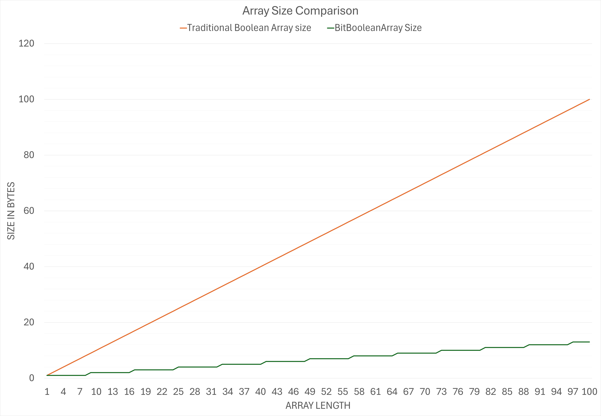
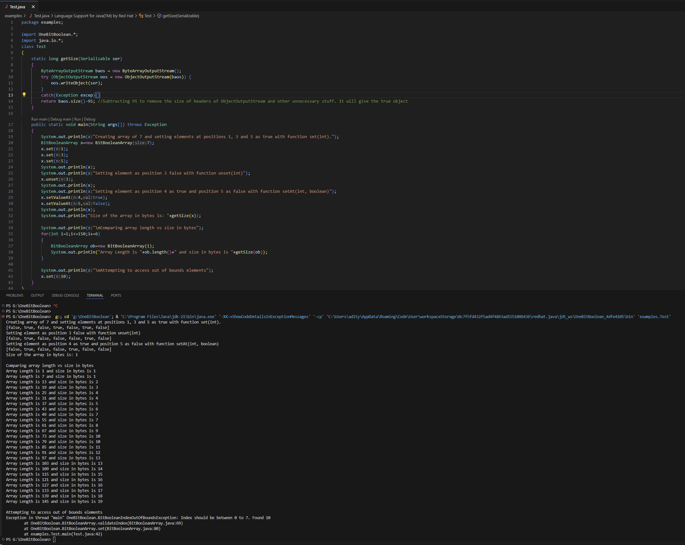

# One Bit Boolean

This Java Package is aimed to create Boolean arrays that take only 1 bit to store a Boolean.
Java usually reserves a whole byte (8 bits) for a Boolean value, which is a waste of memory.

# Size comparison

# Usage
Please view docs.

# Contributing
Feel free to fork this repository and make Pull Requests or create Issues.

# Output

